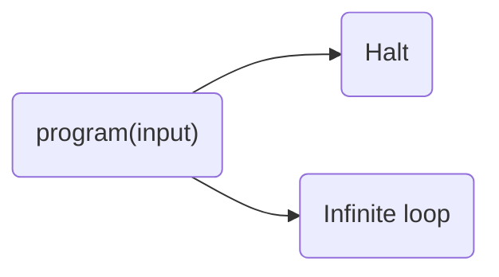

---
{"dg-publish":true,"permalink":"/csc-3001-discrete-math/propositional-logic/","created":"2026-09-07T16:08:30.377+08:00","updated":"2026-09-10T10:47:09.649+08:00","dg-note-properties":{}}
---

## Introduction 引入
### Turing's Halting Problems 停机问题
所有计算机程序只有两个结局——
- 停止：程序顺利执行完毕
- 死循环

这里有两个程序：
```python
def countdown(n):
	while n > 0:
		n -= 1
```
这个程序 `countdown`  很容易看出最终是会 halt 的，因为它不断减少 $n$ 的值，直到 $n<=0$ 便停止。
```python
def mystep(n):
	while n != 1:
		if n%2 == 0:
			n = n//2 # 偶数整除2
		else:
			n = 3*n + 1 # 奇数乘 3 加 1
```
第二个程序  `mystep`  便无法直接判断是否会 halt，因为 $n$ 不一定会出现 1 的值。

**问题：** 世界上是否存在一个程序可以检测所输入的程序是 Halt 还是 Infinite loop
#### Proof
假如这个程序 `LoopChecker`  真的存在
```python
def LoopChecker(program, input):
	if ...:
		return "Halt"
	else:
		return "Infinite loop"
```
那我们可以创建一个程序 `trouble` ，把 `LoopChecker` 的结果反过来，即如果程序是 halt 的，我就让它死循环，如果是 infinite loop 的，我就中断它。这个就是 proof by contradiction。
```python
def trouble(program, input):
	if LoopChecker(program, input) == "Halt":
		while True: # 死循环
			... 
	else: 
		return # 中断
```
---
## Logic and Basic Operators
### Statement / Proposition
> [!important] Definition
> A statement is a sentence that is either True or False.

Examples:
- $2+2=4$ is a statement
- $x+y>0$ is **not** a statement
- $x^2 +y^2 = z^2$ is **not** a statement
> [!tip] 
不提供 $x,y$ 则无法判断 True or False

### Logic Operators
Logic operators are used to construct new statements from old statements
- NOT ($\neg$)
- AND ($\wedge$)
- OR ($\vee$)

| P     | Q     | **P $\wedge$ Q** | P $\vee$ Q |
| ----- | ----- | ---------------- | ---------- |
| True  | True  | **True**         | **True**   |
| True  | False | **False**        | **True**   |
| False | True  | **False**        | **True**   |
| False | False | **False**        | **False**  |
We can define logic operators on three or more statements, e.g.
$$
\overline{p\wedge q} \vee r
$$
> [!note]
> $\overline{\text{   }}$ 是 NOT 的另外一种写法
> $$
> \overline{p\wedge q}\vee r \equiv \neg(p \wedge q) \vee r
> $$

### Logic Operators Construction
We can construct new operator from AND, OR, NOT
#### Exclusive-or (XOR) 异或
- When $p=q$, return False
- When $p\ne q$, return True

$$
p\oplus q \equiv (p\vee q )\wedge \neg(p\wedge q)
$$
| $p$   | $q$   | $p\vee q$ | $\neg (p \wedge q)$ | $p\oplus q \equiv (p\vee q )\wedge \neg(p\wedge q)$ |
| ----- | ----- | --------- | ------------------- | --------------------------------------------------- |
| True  | True  | **True**  | **False**           | **False**                                           |
| True  | False | **True**  | **True**            | **True**                                            |
| False | True  | **True**  | **True**            | **True**                                            |
| False | False | **False** | **True**            | **False**                                           |

$(p\vee q )\wedge \neg(p\wedge q)$ 只是其中一种定义，只要你所写的定义返回的值跟 $\oplus$ 一致 (logical equivalence)，便是 $\oplus$ 的定义。

> [!important]
> **Logical equivalence:** Two statement have the same truth table

$$
\begin{align*}
p \oplus q &\equiv (p\wedge \neg q) \vee (\neg p \wedge q)\\
&\equiv \neg (p \wedge q)\wedge \neg(\neg p \wedge \neg q)
\end{align*}
$$
### Writing Logical Formula for a Truth Table
1. 看 True 的行，撰写 logic statement，之后用 OR 连接
2. 看 False 的行，撰写 logic statement 后用 AND 连接

#### Idea 1: Focus on True Row
| p   | q   | r   | output | Logic statement                        |
| --- | --- | --- | ------ | -------------------------------------- |
| T   | T   | T   | F      |                                        |
| T   | T   | F   | **T**  | $(p\wedge q \wedge \neg r)$            |
| T   | F   | T   | **T**  | $\vee (p\wedge \neg q \wedge r)$       |
| T   | F   | F   | F      |                                        |
| F   | T   | T   | **T**  | $\vee(\neg p \wedge q \wedge r)$       |
| F   | T   | F   | **T**  | $\vee (\neg p \wedge q \wedge \neg r)$ |
| F   | F   | T   | **T**  | $\vee (\neg p \wedge \neg q \wedge r)$ |
| F   | F   | F   | F      |                                        |

Hence, the logic statement is 
$$
(p\wedge q \wedge \neg r) \vee (p\wedge \neg q \wedge r) \vee(\neg p \wedge q \wedge r) \vee (\neg p \wedge q \wedge \neg r) \vee (\neg p \wedge \neg q \wedge r)
$$

#### Idea 2: Focus on False Row
| p   | q   | r   | output | Logic statement                                 |
| --- | --- | --- | ------ | ----------------------------------------------- |
| T   | T   | T   | **F**  | $\neg (p\wedge q \wedge r)$                     |
| T   | T   | F   | T      |                                                 |
| T   | F   | T   | T      |                                                 |
| T   | F   | F   | **F**  | $\wedge \neg (p \wedge \neg q \wedge \neg r)$   |
| F   | T   | T   | T      |                                                 |
| F   | T   | F   | T      |                                                 |
| F   | F   | T   | T      |                                                 |
| F   | F   | F   | **F**  | $\wedge \neg(\neg p\wedge \neg q\wedge \neg r)$ |

The logic statement is 
$$
\neg (p\wedge q \wedge r) \wedge \neg (p \wedge \neg q \wedge \neg r) \wedge \neg(\neg p\wedge \neg q\wedge \neg r)
$$
The logic statement of [[CSC3001 Discrete Math/Propositional Logic#Idea 1 Focus on True Row\|#Idea 1 Focus on True Row]] and [[CSC3001 Discrete Math/Propositional Logic#Idea 2 Focus on False Row\|#Idea 2 Focus on False Row]] are logically equivalent.

---
## Logical Rules
> $\mathbf t$ 指 tautology 永真，即 TRUE
> $\mathbf c$ 指 contradiction 永假，即 FALSE

| Logical Rules                          | Explanation                                       | Case 1                                                      | Case 2                                                    |
| :------------------------------------- | :------------------------------------------------ | :---------------------------------------------------------- | :-------------------------------------------------------- |
| Commutative laws（交换律）                  | 两边可互换                                             | $p \wedge q \equiv q \wedge p$                              | $p \vee q \equiv q \vee p$                                |
| Associative laws（结合律）                  | 只用同一种运算符时，括号不影响结果                                 | $(p \wedge q) \wedge r \equiv p \wedge (q \wedge r)$        | $(p \vee q) \vee r \equiv p \vee (q \vee r)$              |
| Distributive laws（分配律）                 | 等同于乘法分配律 $a(b+c)=ab+ac$                           | $p \wedge (q \vee r) \equiv (p \wedge q) \vee (p \wedge r)$ | $p \vee (q \wedge r) \equiv (p \vee q) \wedge (p \vee r)$ |
| Identity laws（同一律）                     | 当 $\mathbf t$ 在 AND、$\mathbf c$ 在 OR 时，结果保持不变     | $p \wedge \mathbf{t} \equiv p$                              | $p \vee \mathbf{c} \equiv p$                              |
| Negation laws（否定律）                     | 自己和自己取反：OR 必真、AND 必假                              | $p \vee {\neg}p \equiv \mathbf{t}$                          | $p \wedge {\neg}p \equiv \mathbf{c}$                      |
| Double negative law（双重否定律）             | 负负得正                                              | ${\neg}({\neg}p) \equiv p$                                  |                                                           |
| Idempotent laws（幂等律）                   | 重复不改变结果                                           | $p \wedge p \equiv p$                                       | $p \vee p \equiv p$                                       |
| Universal bound laws（domination／范围律）   | OR 遇到 $\mathbf t$ 为恒真；<br>AND 遇到 $\mathbf c$  为恒假 | $p \vee \mathbf{t} \equiv \mathbf{t}$                       | $p \wedge \mathbf{c} \equiv \mathbf{c}$                   |
| De Morgan's laws（德摩根律）                 | 展开后 OR、AND 调转                                     | ${\neg}(p \wedge q) \equiv {\neg}p \vee {\neg}q$            | ${\neg}(p \vee q) \equiv {\neg}p \wedge {\neg}q$          |
| Absorption laws（吸收律）                   | 括号内的结果无关大雅                                        | $p \vee (p \wedge q) \equiv p$                              | $p \wedge (p \vee q) \equiv p$                            |
| Negations of **t** and **c**（永真／永假的否定） | $\mathbf t$ 和 $\mathbf c$ 是相反的                    | ${\neg}\mathbf{t} \equiv \mathbf{c}$                        | ${\neg}\mathbf{c} \equiv \mathbf{t}$                      |

**Proof of Absorption law**
$$
\begin{align*}
 L.H.S. &\equiv p \vee (p \wedge q) \\
 &\equiv (p\wedge \mathbf t)\vee (p\wedge q)\\
 &\equiv p\wedge(\mathbf t \vee q)\\
 &\equiv p\wedge \mathbf t\\
 &\equiv p\\
 &\equiv R.H.S.
\end{align*}
$$

### Simplify Statement
[Exercise generated by AI](https://www.workbuddy.link/p/0VPHiO7JIQKpIA74B9Nfpf?ext2=copy_link)
1. Simplify $(q\wedge p) \wedge \neg p$
$$
\begin{align*}
(q\wedge p) \wedge \neg p 
&\equiv q\wedge (p\wedge \neg p)\\
&\equiv q \wedge \mathbf c\\
&\equiv \mathbf c
\end{align*}
$$
2. Simplify $(p\wedge q)\vee (p\wedge \neg q)$
$$
\begin{align*}
(p\wedge q)\vee (p\wedge \neg q) 
&\equiv p\wedge (q\vee \neg q)\\
&\equiv p\wedge \mathbf t\\
&\equiv p
\end{align*}
$$
3. Simplify $(p\wedge q)\vee (p\wedge q \wedge r)$
$$
\begin{align*}
(p\wedge q)\vee (p\wedge q \wedge r) 
&\equiv (p\wedge q)\vee [(p\wedge q) \wedge r] \\
&\equiv (p\wedge q)
\end{align*}
$$
4. Simplify $\neg (\neg p \vee q)\wedge (p\vee q)$
$$
\begin{align*}
\neg (\neg p \vee q)\wedge (p\vee q) 
&\equiv (p \wedge \neg q) \wedge (p\vee q)\\
&\equiv \neg q\wedge [p\wedge (p\vee q)]\\
&\equiv \neg q \wedge p\\
\end{align*}
$$
5. Simplify $\neg (\neg (p\vee q)\wedge \neg q)$
$$
\begin{align*}
\neg (\neg (p\vee q)\wedge \neg q) &\equiv (p\vee q) \vee q\\
&\equiv (p\vee q) \vee (q\vee q)\\
&\equiv (p\vee q)\vee q\\
&\equiv p\vee q
\end{align*}
$$
6. Simplify $(p\wedge q)\vee (p \wedge \neg q)\vee (\neg p \wedge q)$
$$
\begin{align*}
(p\wedge q)\vee (p \wedge \neg q)\vee (\neg p \wedge q)
&\equiv p\wedge(q\vee \neg q) \vee (\neg p \wedge q)\\
&\equiv p \wedge \mathbf t \vee (\neg p\wedge q)\\
&\equiv p\vee (\neg p \wedge q)\\
&\equiv (p\vee \neg p) \wedge (p\vee q)\\
&\equiv \mathbf t \wedge (p\vee q)\\
&\equiv p\vee q
\end{align*}
$$

---
## Conditional Statement
### IF-Then
$$
\underbrace{p}_{\text{hypothesis}} \to \underbrace{q}_{\text{conclusion}}
$$
It means
- If $p$, then $q$; OR
- $p$ implies $q$

| $P$ | $Q$ | $P\to Q$ |
| --- | --- | -------- |
| T   | T   | T        |
| T   | F   | F        |
| F   | T   | T        |
| F   | F   | T        |

只有当前提 hypothesis $P$ 为 TRUE ，且结论 $Q$ 是 FALSE 时，$P\to Q$ 才会是 FASLE
如果前提 $P$ 本身为 FALSE 时，无论结论 $Q$ 如何，都是 TRUE

#### Logical Formula for If-Then
我们可以用 [[CSC3001 Discrete Math/Propositional Logic#Writing Logical Formula for a Truth Table\|#Writing Logical Formula for a Truth Table]] 的方式推导 If 的 logical formula 
##### Idea 1: Focus on TRUE
| $P$ | $Q$ | $P \to Q$ | Logical statement            |
| --- | --- | --------- | ---------------------------- |
| T   | T   | T         | $(P\wedge Q)$                |
| T   | F   | F         |                              |
| F   | T   | T         | $\vee (\neg P \wedge Q)$     |
| F   | F   | T         | $\vee (\neg P\wedge \neg Q)$ |

The logical formula is 
$$
\begin{align*}
(P\wedge Q)\vee (\neg P \wedge Q)\vee (\neg P\wedge \neg Q) &\equiv Q\wedge \underbrace{(P\vee \neg P)}_{\mathbf t} \vee (\neg P\wedge \neg Q)\\
&\equiv Q\vee(\neg P\wedge \neg Q)\\
&\equiv (Q\vee \neg P ) \wedge \underbrace{(Q\vee \neg Q)}_{\mathbf t}\\
&\equiv \neg P\vee Q
\end{align*}
$$
这个  logical formula 可以很明白的说出 if 的关系，即只要 $Q$ 是 TRUE，$P\to Q$ 必然为 TRUE。
#### Negation of If-Then
如果要否定 $P\to Q$，即 $\neg (P\to Q)$ ，我们要给出 $P$ 为 TRUE，而 $Q$ 为 FALSE 的例子
**Proof**
$$
\begin{align*}
\neg(P\to Q) &\equiv \neg(\neg P \vee Q)\\
&\equiv P\wedge \neg Q
\end{align*}
$$
> [!note]
> 否定 $P\to Q$ 不是代表 $P \to Q$ 为 FALSE，而是 $P\to Q$ 不成立，即 $P\nrightarrow Q$
### Contrapositive 逆否命题
The contrapositive of $p\to q$ is $\boxed{\neg q \to \neg p}$
**Proof**
$$
\begin{align*}
p\to q &\equiv \neg p \vee q\\
&\equiv q \vee \neg p\\
&\equiv \neg q \to \neg p
\end{align*}
$$
有时候直接证 $p \rightarrow q$ 比较难，但证 $\neg q \rightarrow \neg p$ 反而容易。
### If and Only If (IFF)
$$
\begin{align*}
p\iff q &\equiv (p\to q)\wedge (q\to p)\\
&\equiv (p\to q)\wedge (\neg p  \to \neg q)
\end{align*}
$$

| $P$ | $Q$ | $P \leftrightarrow Q$ | $P \to Q$ | $\neg Q \to \neg P$ |
| :-: | :-: | :-------------------: | :-------: | :-----------------: |
|  T  |  T  |           **T**           |     **T**     |          **T**          |
|  T  |  F  |           **F**           |     **F**     |          **F**          |
|  F  |  T  |           **F**           |     **T**     |          **T**          |
|  F  |  F  |           **T**           |     **T**     |          **T**          |
